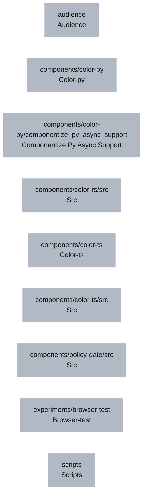

# wasm_mcp_summit dependency graph

> Generated by [stacklit](https://github.com/glincker/stacklit) on 2026-06-05. Run `stacklit generate` to update.

```mermaid
graph LR
  classDef javascript fill:#c9d1d9,color:#0d1117,stroke:#c9d1d9
  classDef python fill:#b1bac4,color:#0d1117,stroke:#b1bac4
  classDef rust fill:#a5b3bf,color:#0d1117,stroke:#a5b3bf
  classDef typescript fill:#c9d1d9,color:#0d1117,stroke:#c9d1d9
  audience["audience<br/>Audience"]:::python
  components_color_py["components/color-py<br/>Color-py"]:::python
  components_color_py_componentize_py_async_support["components/color-py/componentize_py_async_support<br/>Componentize Py Async Support"]:::python
  components_color_rs_src["components/color-rs/src<br/>Src"]:::python
  components_color_ts["components/color-ts<br/>Color-ts"]:::python
  components_color_ts_src["components/color-ts/src<br/>Src"]:::python
  components_policy_gate_src["components/policy-gate/src<br/>Src"]:::python
  experiments_browser_test["experiments/browser-test<br/>Browser-test"]:::python
  scripts["scripts<br/>Scripts"]:::python
```
